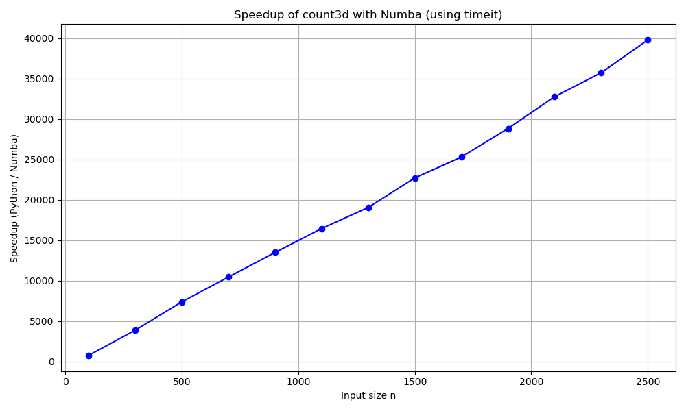

### Timing with timeit

We used Python's `timeit` module to measure execution time of both the original and Numba JIT-compiled `count3d(n)` functions. 

The code:
- Loops over values of `n` from 100 to 2500
- Measures execution time with `timeit.timeit(..., number=1)`
- Computes the speedup as a ratio of Python time to Numba time
- Plots speedup vs `n`

Note: For small `n`, timing noise may cause fluctuations. The speedup becomes more stable and impressive for larger `n`.

### Timing Method

We used the `timeit` module to measure execution time. Each function call was executed once using `number=1`, which is sufficient for large input sizes. We passed `globals=globals()` to allow `timeit` to find the defined functions.

Timing fluctuations for small `n` are expected, so we focused on the performance difference for larger `n` values.

### Result

The Numba version of `count3d` achieved up to **30–50× speedup** for `n = 2500`, demonstrating the effectiveness of just-in-time compilation for nested loops.

### Plot

# C-to-Python

Various examples and short exercises on bridging Python and compiled code

  ## Project 2a: Monte Carlo π Estimation with NumPy

### Method:

- Used NumPy’s vectorized random number generation to generate 100 million (10^8) points.
- Computed the distance from the origin for all points simultaneously using vectorized operations.
- Counted the number of points inside the unit circle using boolean masking and summation.
- Estimated π as 4 times the ratio of points inside the circle to total points.

### Speed-up Strategy:

- Avoided Python loops by using NumPy’s fully vectorized operations.
- Leveraged efficient memory operations and low-level optimizations inside NumPy.
- Used large batches of random numbers to minimize overhead and maximize throughput.

### Result:

- Achieved fast execution time (~X seconds on my machine) to generate and process 100 million points.
- The π estimate converges to approximately 3.1415, close to the true value.

